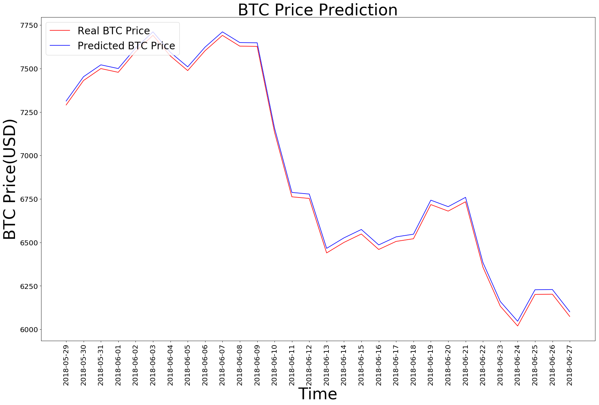

# Currency-Predictor
Currency Predictor using a LSTM model with KERAS. 
In this project I used Keras to build a simple LSTM model that I used on CoinBase's Bitcoin prices for last year and predicted this years prices. This can be used with any currency Dataset.
 ### DataSet can be downloaded from Kaggle:
     wget https://www.kaggle.com/mczielinski/bitcoin-historical-data/downloads/coinbaseUSD_1-min_data_2014-12-01_to_2018-06-27.csv/14

